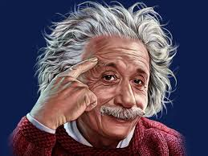
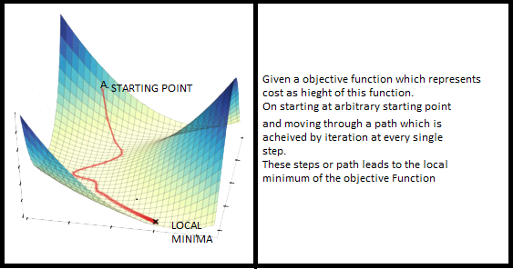

# einstein-puzzle

Solution to a riddle attributed to Einstein



## Purpose

At first, it seemed like Python might have been a better choice for solving this problem. On my first pass, I cursed myself for choosing a language that was clunkier to work in than Python. (I picked C++ just to get a little practice, since it hadn't been my "main" language in a couple years.)

However, after a first solution that got excessively complicated, I decided to redo this code and use a more brute force approach, simply maintaining a list of all possible valid combinations after each step in solving the puzzle. There are never more than hundreds of combinations in memory, and C++'s speed made cracking the puzzle lighting-fast.

As a second feature, I added the ability to generate new puzzles. See below.

## Description

Original text: 

*Variations of this riddle appear on the net from time to time. It is sometimes attributed to Albert Einstein and it is claimed that 98% of the people are incapable of solving it. Some commentators suggest that Einstein created such puzzles not to test out intelligence but to get rid of all the students who wanted him as an advisor. It is not likely that there is any truth to these stories. Wherever this comes from, it is a nice riddle.*

*Let us assume that there are five houses of different colors next to each other on the same road. In each house lives a man of a different nationality. Every man has his favorite drink, his favorite brand of cigarettes, and keeps pets of a particular kind.*

(Clearly, this is an old riddle, given the maleness, Europeaness, and how everyone smokes.)

  
`"As your academic advisor here at 1950s MIT, I'd like to hear how your thesis is coming along."`

* *The Englishman lives in the red house.*
* *The Swede keeps dogs.*
* *The Dane drinks tea.*
* *The green house is just to the left of the white one.*
* *The owner of the green house drinks coffee.*
* *The Pall Mall smoker keeps birds.*
* *The owner of the yellow house smokes Dunhills.*
* *The man in the center house drinks milk.*
* *The Norwegian lives in the first house.*
* *The Blend smoker has a neighbor who keeps cats.*
* *The man who smokes Blue Masters drinks bier.*
* *The man who keeps horses lives next to the Dunhill smoker.*
* *The German smokes Prince.*
* *The Norwegian lives next to the blue house.*
* *The Blend smoker has a neighbor who drinks water.*

*The question to be answered is: **Who keeps fish?***

  
`"All of them?"`

These are the possible preferences in each category:

```
string categories[] = { "address", "color", "nationality", "drink", "cigarette", "pet" };
string addresses[] = { "1", "2", "3", "4", "5" };
string colors[] = { "blue", "green", "red", "white", "yellow" };
string nationalities[] = { "Danish", "English", "German", "Swedish", "Norwegian" };
string drinks[] = { "beer", "coffee", "milk", "tea", "water" };
string cigarettes[] = { "Blend", "Bluemaster", "Dunhill", "Pall Mall", "Prince" };
string pets[] = { "bird", "cat", "dog", "fish", "horse" };
```

Note that each preference is unique to a single household, i.e. there's only one cat owner.

## My solution

My first attempted solution involved maintaining a giant table and eliminating possibilities as each rule in the puzzle was executed. This worked up to a point, but when the program reached the "fish" rule, there still wasn't a clear solution. The only way forward from there was to try all the remaining possibilities by brute force until the puzzle was solved.

Therefore, it seemed to me that I'd be better off throwing away the overly complicated code I'd written and starting over, making the trying out of different combinations the heart of the new solution. 

So, that's how the current version of the program works, as described above.

(the fish lives with the German)

## Generating new puzzles



As an extra challenge, I thought it would be fun to create a feature that generates new puzzles. In other words, it starts with a random street like the one below, then comes up with a sequence of rules that yield a fun puzzle. For a puzzle to be "fun", these conditions apply:

* There must be only one street configuration that fits the rules
* There must be less than twenty-five rules that yield a solution (usually it's easy to achieve the high teens)
* The last rule (e.g. "who owns a fish?") must involve a characteristic that's hard to derive before all the rules are applied.
* There must be a pleasing distribution to pair, neighbor, and address rules, with no characteristic appearing more than once or twice.

```
1                   2                   3                   4                   5
---------           ---------           ---------           ---------           ---------
white               blue                yellow              red                 green
Norwegian           Danish              English             Swedish             German
milk                beer                coffee              tea                 water
Dunhill             Bluemaster          Pall Mall           Prince              Blend
bird                dog                 horse               cat                 fish
```

The heuristic works by generating random rule sequences that are limited to some maximum number of steps. Many randomly-generated rule sequences just won't work. When the heuristic finds one that does, it saves a copy of that sequence and then repeatedly iterates on it, making small random modifications in hope of arriving at more efficient solution. This is a little bit comparable to how genetic algorithms work and a little bit comparable to gradient-descent in machine learning.

The puzzle generator isn't especially fast, but it runs in a matter of seconds. I figured that speed was more of the essence in *SOLVING* puzzles, not making them.

Here is some sample output:

```
1                   2                   3                   4                   5
---------           ---------           ---------           ---------           ---------
*                   blue                yellow              red                 green
Norwegian           Danish              English             Swedish             German
milk                *                   coffee              tea                 water
*                   Bluemaster          Pall Mall           Prince              Blend
bird                dog                 horse               cat                 fish

Finished street list of size: 1

Rules:17
"address 3 'English'",
"pair 'red' 'Swedish'",
"pair 'fish' 'Blend'",
"pair 'yellow' 'coffee'",
"address 4 'Swedish'",
"neighbor 'dog' 'Pall Mall' 1",
"pair 'blue' 'Danish'",
"pair 'tea' 'cat'",
"pair 'horse' 'coffee'",
"neighbor 'Danish' 'Norwegian'",
"pair 'green' 'water'",
"neighbor 'bird' 'blue' 1",
"pair 'water' 'German'",
"neighbor 'bird' 'Bluemaster'",
"pair 'Prince' 'cat'",
"neighbor 'dog' 'milk'",
"single 'beer'"

The English person is at the third address.
The red house's owner is Swedish.
The fish owner smokes Blend.
The yellow house's owner drinks coffee.
The Swedish person is at the fourth address.
The dog owner is to the left of the Pall Mall smoker.
The blue house's owner is Danish.
The tea drinker owns a cat.
The horse owner drinks coffee.
The Danish person is neighbors with the Norwegian person.
The green house's owner drinks water.
The bird owner is to the left of the blue house.
The water drinker is German.
The bird owner is neighbors with the Bluemaster smoker.
The Prince smoker owns a cat.
The dog owner is neighbors with the milk drinker.
Who drinks beer?
```

## How to run

I developed this code in Visual Studio 2019. The solution and project files are provided.

Build it per usual process, then run from the command line as follows:

```
PS D:\CodingProjects\CPP\EinsteinProblem\Release> .\EinsteinProblem.exe help
Einstein's Puzzle
-----------------
(Use 'help' argument for help)
Arguments: help

Use 'basic' argument (or nothing) to solve basic puzzle. Use 'generate' argument to generate puzzle.
PS D:\CodingProjects\CPP\EinsteinProblem\Release>
```

## Future possibilities

* I don't totally like the approach of trying different combinations. I think there's a more efficient way of solving the problem, one that starts by placing the fish in a particular house and applying the rules until one of them fails. If there is a failure, then the fish doesn't go in that house.

